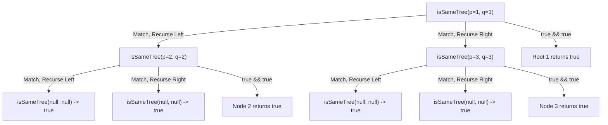

# Same Binary Tree

## Problem Description

**Difficulty**: Easy

Given the roots of two binary trees `p` and `q`, return `true` if the trees are **equivalent**, otherwise return `false`.

Two binary trees are considered **equivalent** (or the **same**) if they satisfy two conditions simultaneously:
1. They share the **exact same structural shape**.
2. Corresponding nodes at identical positions contain the **exact same values**.

**Key Concepts:**
- **Simultaneous Traversal**: Traverse both trees `p` and `q` in lockstep.
- **Structural Identity**: Every node present in `p` must be present in `q`, and every `null` in `p` must be `null` in `q`.
- **Value Identity**: If both nodes exist, `p.val == q.val`.
- **Recursive Base Cases**:
  - Both `null` $\rightarrow$ `true` (both subtrees are empty and identical)
  - One `null`, one non-`null` $\rightarrow$ `false` (structural mismatch)
  - Values differ $\rightarrow$ `false` (value mismatch)
- **Recursive Step**: `isSameTree(p.left, q.left) && isSameTree(p.right, q.right)`

**Visual Overview:**
```
Tree p:                 Tree q:
       1                       1
      / \                     / \
     2   3                   2   3

At Node (1, 1): Values match (1 == 1) ✓
  Recurse Left: (2, 2) -> Values match (2 == 2) ✓
    Recurse Left: (null, null) -> true ✓
    Recurse Right: (null, null) -> true ✓
  Recurse Right: (3, 3) -> Values match (3 == 3) ✓
    Recurse Left: (null, null) -> true ✓
    Recurse Right: (null, null) -> true ✓

Result: true (Identical structure and values)

Mismatch Example (Structure):
Tree p:                 Tree q:
       1                       1
      /                         \
     2                           2

At Node (1, 1): Values match (1 == 1) ✓
  Recurse Left: (2, null) -> Structural Mismatch ✗ -> false
Result: false
```

**Recommended Complexity**: O(n) time, O(n) space (where n is the minimum/maximum number of nodes in the trees).

---

## Examples

### Example 1 (Identical Trees):
```
Input: p = [1,2,3], q = [1,2,3]

Tree p:          Tree q:
    1                1
   / \              / \
  2   3            2   3

Output: true

Explanation:
- Roots match: p.val = 1, q.val = 1
- Left subtrees match: p.left.val = 2, q.left.val = 2
- Right subtrees match: p.right.val = 3, q.right.val = 3
- All leaves have null children matching null children
Result: true
```

### Example 2 (Structural Mismatch - Left vs Right Child):
```
Input: p = [4,7], q = [4,null,7]

Tree p:          Tree q:
    4                4
   /                  \
  7                    7

Output: false

Explanation:
- Roots match: p.val = 4, q.val = 4
- Checking left subtrees: p.left (7) vs q.left (null) -> mismatch!
One node is present while the other is null.
Result: false
```

### Example 3 (Value Mismatch):
```
Input: p = [1,2,3], q = [1,3,2]

Tree p:          Tree q:
    1                1
   / \              / \
  2   3            3   2

Output: false

Explanation:
- Roots match: 1 == 1
- Left subtrees: p.left.val = 2, q.left.val = 3 -> 2 != 3 -> mismatch!
Result: false
```

### Example 4 (Both Empty Trees):
```
Input: p = [], q = []

Tree p: null     Tree q: null

Output: true

Explanation:
Both roots are null. Two empty trees are identical.
```

### Example 5 (One Empty Tree, One Non-Empty):
```
Input: p = [], q = [1]

Tree p: null     Tree q: 1

Output: false

Explanation:
p is null while q is not null. Structural mismatch at root level.
```

### Example 6 (Single Identical Node):
```
Input: p = [1], q = [1]

Tree p: 1        Tree q: 1

Output: true

Explanation:
p.val = 1, q.val = 1. Both left and right children are null.
```

### Example 7 (Single Node with Different Values):
```
Input: p = [1], q = [2]

Tree p: 1        Tree q: 2

Output: false

Explanation:
p.val = 1 != q.val = 2. Value mismatch.
```

### Example 8 (Multi-level Skewed Identical Trees):
```
Input: p = [1,2,null,3], q = [1,2,null,3]

Tree p:          Tree q:
    1                1
   /                /
  2                2
 /                /
3                3

Output: true

Explanation:
Both trees are left-skewed with identical values (1 -> 2 -> 3) at each depth.
```

### Example 9 (Multi-level Deep Value Mismatch at Leaf):
```
Input: p = [1,2,3,4,5], q = [1,2,3,4,6]

Tree p:             Tree q:
       1                   1
      / \                 / \
     2   3               2   3
    / \                 / \
   4   5               4   6

Output: false

Explanation:
All nodes match until comparing right child of node 2: p has 5, q has 6 -> mismatch!
```

### Example 10 (Different Sized Trees):
```
Input: p = [1,2,3,4], q = [1,2,3]

Tree p:             Tree q:
       1                   1
      / \                 / \
     2   3               2   3
    /
   4

Output: false

Explanation:
p has node 4 as left child of 2, whereas q has null as left child of 2.
```

---

## Constraints
- The number of nodes in both trees is in the range `[0, 100]`.
- `-100 <= Node.val <= 100`

**Recommended Complexity**:
- Time: $O(\min(N, M))$ where $N$ and $M$ are the number of nodes in trees `p` and `q`. We visit nodes simultaneously and stop at the first mismatch.
- Space: $O(\min(H_p, H_q))$ where $H_p, H_q$ are the tree heights, representing the recursion stack (up to $O(N)$ in skewed trees).

---

## Pattern Recognition

**Primary Pattern**: **Simultaneous Tree DFS / Dual Tree Traversal**

**Why This Pattern?**
- We need to compare two tree structures node-by-node.
- Synchronized recursive traversal (Pre-order DFS) allows us to validate the root first, and only if valid, explore both left subtrees and right subtrees in parallel.
- Short-circuit evaluation (`&&`) ensures that as soon as any mismatch is detected, recursion unwinds immediately without traversing the remainder of the trees.

```
       Dual Tree DFS Pattern Template:
       
       isSame(p, q):
         1. Base Cases:
            - If both p and q are null -> return true
            - If one is null or p.val != q.val -> return false
         2. Recursive Calls:
            - return isSame(p.left, q.left) && isSame(p.right, q.right)
```

**Key Architectural Insights**:
1. **Three Fundamental States at Any Step**:
   - **Both Null**: Subtrees are structurally identical and empty $\rightarrow$ `return true`.
   - **One Null / Value Mismatch**: Subtrees violate identity $\rightarrow$ `return false`.
   - **Both Non-Null & Values Match**: Current nodes match $\rightarrow$ recursively verify `(p.left, q.left)` AND `(p.right, q.right)`.

2. **Pre-Order Evaluation Order**:
   - Checking `p.val == q.val` before recursing on children is effectively a **Pre-order DFS** (`Root -> Left -> Right`).
   - If root values or structures don't match, we fail early without visiting subtrees.

3. **Breadth-First Search (BFS) Alternative**:
   - We can also traverse both trees level-by-level using a single queue or two queues.
   - Enqueue pairs `(p_node, q_node)`.
   - Dequeue and validate structure and values at each iteration.

---

## Algorithm & Approach

### Approach 1: Recursive DFS (Simultaneous Pre-Order) — Recommended / Optimal

#### Method Explanation:
1. If both `p` and `q` are `null`, return `true`.
2. If `p == null || q == null` (meaning exactly one is null since step 1 failed), return `false`.
3. If `p.val != q.val`, return `false`.
4. Recursively check if `isSameTree(p.left, q.left)` AND `isSameTree(p.right, q.right)`.

#### Java Code Implementation:
```java
/**
 * Definition for a binary tree node.
 * public class TreeNode {
 *     int val;
 *     TreeNode left;
 *     TreeNode right;
 *     TreeNode() {}
 *     TreeNode(int val) { this.val = val; }
 *     TreeNode(int val, TreeNode left, TreeNode right) {
 *         this.val = val;
 *         this.left = left;
 *         this.right = right;
 *     }
 * }
 */
public class SameBinaryTree {

    /**
     * Determines if two binary trees are structurally identical and have matching node values.
     * 
     * @param p Root of the first binary tree
     * @param q Root of the second binary tree
     * @return true if trees are identical, false otherwise
     */
    public boolean isSameTree(TreeNode p, TreeNode q) {
        // Base case 1: Both nodes are null -> identical empty subtrees
        if (p == null && q == null) {
            return true;
        }

        // Base case 2: One node is null, or node values do not match
        if (p == null || q == null || p.val != q.val) {
            return false;
        }

        // Recursive case: Validate both left and right subtrees in parallel
        return isSameTree(p.left, q.left) && isSameTree(p.right, q.right);
    }
}
```

---

### Approach 2: Iterative BFS using a Queue

#### Method Explanation:
1. Use a `Queue<TreeNode>` to store pairs of corresponding nodes from `p` and `q`.
2. Push `p` and `q` into the queue.
3. While the queue is not empty:
   - Poll `nodeP` and `nodeQ`.
   - If both are `null`, continue to the next pair.
   - If one is `null` or `nodeP.val != nodeQ.val`, return `false`.
   - Enqueue `nodeP.left` and `nodeQ.left`.
   - Enqueue `nodeP.right` and `nodeQ.right`.
4. If the queue becomes empty without finding any discrepancy, return `true`.

#### Java Code Implementation:
```java
import java.util.LinkedList;
import java.util.Queue;

public class SameBinaryTreeBFS {

    public boolean isSameTree(TreeNode p, TreeNode q) {
        Queue<TreeNode> queue = new LinkedList<>();
        queue.offer(p);
        queue.offer(q);

        while (!queue.isEmpty()) {
            TreeNode nodeP = queue.poll();
            TreeNode nodeQ = queue.poll();

            // Both null at this position
            if (nodeP == null && nodeQ == null) {
                continue;
            }

            // One is null or values differ
            if (nodeP == null || nodeQ == null || nodeP.val != nodeQ.val) {
                return false;
            }

            // Add left children pair
            queue.offer(nodeP.left);
            queue.offer(nodeQ.left);

            // Add right children pair
            queue.offer(nodeP.right);
            queue.offer(nodeQ.right);
        }

        return true;
    }
}
```

---

### Approach 3: Iterative DFS using a Stack

#### Method Explanation:
1. Use an explicit `Deque<TreeNode>` or `Stack<TreeNode>` to simulate recursion.
2. Push `p` and `q`.
3. Pop pairs, validate identically to the BFS approach, and push matching children pairs onto the stack.

#### Java Code Implementation:
```java
import java.util.ArrayDeque;
import java.util.Deque;

public class SameBinaryTreeDFS {

    public boolean isSameTree(TreeNode p, TreeNode q) {
        Deque<TreeNode> stack = new ArrayDeque<>();
        stack.push(p);
        stack.push(q);

        while (!stack.isEmpty()) {
            TreeNode nodeQ = stack.pop();
            TreeNode nodeP = stack.pop();

            if (nodeP == null && nodeQ == null) {
                continue;
            }

            if (nodeP == null || nodeQ == null || nodeP.val != nodeQ.val) {
                return false;
            }

            // Push right children pair
            stack.push(nodeP.right);
            stack.push(nodeQ.right);

            // Push left children pair
            stack.push(nodeP.left);
            stack.push(nodeQ.left);
        }

        return true;
    }
}
```

---

## Why This Strategy?

### Comparison of Approaches

| Criteria | Recursive DFS | Iterative BFS (Queue) | Iterative DFS (Stack) |
| :--- | :--- | :--- | :--- |
| **Lines of Code** | **~6 lines (Extremely clean)** | ~25 lines | ~25 lines |
| **Time Complexity** | $O(\min(N, M))$ | $O(\min(N, M))$ | $O(\min(N, M))$ |
| **Space Complexity** | $O(H)$ recursion stack | $O(W)$ tree width | $O(H)$ explicit stack |
| **Early Exit** | Immediate on mismatch | Immediate on mismatch | Immediate on mismatch |
| **Stack Overflow Risk** | Only if $H > 10,000$ | None (Heap memory) | None (Heap memory) |
| **Interview Recommendation**| ⭐ **Top Choice** | Great follow-up discussion | Great alternative |

### Why Recursive DFS is Preferred in Interviews:
1. **Mathematical Elegance**: A tree is naturally a recursively defined data structure. Two trees $T_1$ and $T_2$ are equivalent if and only if:
   $$\text{Root}(T_1) \equiv \text{Root}(T_2) \land \text{Left}(T_1) \equiv \text{Left}(T_2) \land \text{Right}(T_1) \equiv \text{Right}(T_2)$$
2. **Conciseness**: The logic reduces to 3 base conditions and 1 return statement.
3. **Short-Circuiting**: The logical `&&` automatically skips evaluating the right subtree if the left subtree fails.

---

## Critical Edge Cases & Gotchas

### 1. Both Trees Empty (`p = null, q = null`)
- **Expected Result**: `true`
- **Handling**: `if (p == null && q == null) return true;` must precede any access to `p.val` or `q.val`.

### 2. One Tree Empty, One Non-Empty (`p = null, q = [1]` or `p = [1], q = null`)
- **Expected Result**: `false`
- **Handling**: Caught by `if (p == null || q == null) return false;`.

### 3. Structural Mirror Symmetry Instead of Equivalence (`p = [1, 2, null]`, `q = [1, null, 2]`)
- **Expected Result**: `false`
- **Handling**: Traversing `(p.left, q.left)` compares node `2` with `null`, returning `false`.

### 4. Same Values in Inorder/Preorder but Different Shapes
- Tree 1: `1 -> left: 2` vs Tree 2: `2 -> right: 1`
- **Handling**: Position-by-position recursion checks exact child slot matching.

### 5. Single Node Trees with Negative Values
- Nodes with `-100` must match `-100`. In Java, primitive `int` comparison `p.val != q.val` handles negative values safely.

### 6. Deep Left-Skewed Tree vs Deep Right-Skewed Tree
- Both have same sequence of values, but completely opposite branch directions. Synchronized pair check fails at depth 1.

### 7. Large Trees with Value Mismatch at the Last Leaf
- Full traversal required; algorithm executes in $O(N)$ without redundant overhead.

### 8. Null Children Handling in Iterative Approaches
- Using standard `LinkedList` in Java allows inserting `null` references into `Queue`. If using `ArrayDeque`, `null` is forbidden (`NullPointerException`), so `LinkedList` or a custom Pair wrapper is mandatory.

---

## Major Areas Where We Might Go Wrong

### ❌ Mistake 1: NullPointerException on Property Access
```java
// WRONG: If p is null and q is null, p.val throws NullPointerException!
if (p.val != q.val) return false;
if (p == null && q == null) return true;
```
**Correction**: Always evaluate `null` checks before dereferencing `.val`, `.left`, or `.right`.

---

### ❌ Mistake 2: Missing the Single-Null Condition
```java
// WRONG: If p is null and q is not null, p.val throws NPE!
if (p == null && q == null) return true;
if (p.val != q.val) return false; // Throws NPE when one is null!
```
**Correction**:
```java
if (p == null && q == null) return true;
if (p == null || q == null) return false; // One is null, other is not
if (p.val != q.val) return false;
```

---

### ❌ Mistake 3: Comparing Left Child with Right Child (Symmetric Tree Confusion)
```java
// WRONG: This checks for mirror symmetry, NOT same tree!
return isSameTree(p.left, q.right) && isSameTree(p.right, q.left);
```
**Correction**: Compare corresponding branches: `(p.left, q.left)` and `(p.right, q.right)`.

---

### ❌ Mistake 4: Using `||` instead of `&&` in the Recursive Step
```java
// WRONG: Returns true if EITHER left or right subtree matches!
return isSameTree(p.left, q.left) || isSameTree(p.right, q.right);
```
**Correction**: Both subtrees must be identical $\rightarrow$ `&&`.

---

### ❌ Mistake 5: Using `ArrayDeque` with `null` Elements in Iterative BFS
```java
// WRONG: ArrayDeque does NOT permit null elements!
Queue<TreeNode> queue = new ArrayDeque<>();
queue.offer(nodeP.left); // Throws NullPointerException if left child is null!
```
**Correction**: Use `LinkedList` for queue or filter non-null nodes with structural validations before insertion.

---

### ❌ Mistake 6: Prematurely Returning `true` Without Checking Subtrees
```java
// WRONG: Returning true as soon as roots match!
if (p.val == q.val) return true; // Ignores children completely!
```
**Correction**: Matching root values is necessary but not sufficient; both children must also match.

---

### ❌ Mistake 7: Comparing Object Identity Instead of Node Value
```java
// WRONG: If TreeNode values were boxed Integer objects, == checks reference equality!
if (p.val != q.val) ... // (Safe for primitive int, but bug if val was Object/Integer outside cache range)
```
**Correction**: For `int`, `!=` is fine. If `val` were `Integer`, use `!p.val.equals(q.val)`.

---

### ❌ Mistake 8: Forgetting to Check Both Left and Right Subtrees
```java
// WRONG: Left subtree evaluated, right subtree forgotten
boolean leftSame = isSameTree(p.left, q.left);
return leftSame; // Ignores p.right and q.right!
```

---

### ❌ Mistake 9: Incorrect Base Case Ordering
Combining all conditions into a single condensed statement is elegant, but order of evaluation matters due to short-circuit logic:
```java
// CORRECT condensed form:
if (p == null && q == null) return true;
if (p == null || q == null || p.val != q.val) return false;
```

---

### ❌ Mistake 10: Modifying Tree Nodes During Comparison
Tree comparison algorithms must be **read-only**; never modify `p.left`, `p.val`, etc. during traversal.

---

## Complexity Analysis

### Time Complexity: $O(\min(N, M))$
- $N$ is the number of nodes in tree `p`, and $M$ is the number of nodes in tree `q`.
- In the worst case (both trees are identical), the algorithm visits every node in both trees exactly once: $O(N)$ operations.
- In the best/average case (trees differ early), the algorithm terminates immediately at the first mismatched node without visiting remaining nodes: $O(\min(N, M))$.

### Space Complexity: $O(\min(H_p, H_q))$
- Space is determined by the call stack depth in recursive DFS, or queue size in BFS.
- **Balanced Binary Tree**: Height $H = O(\log N)$, so stack space is $O(\log N)$.
- **Completely Skewed Tree (Worst Case)**: Height $H = O(N)$, so stack space is $O(N)$.
- **Iterative BFS Space**: $O(W)$ where $W$ is maximum width of the tree, which can be up to $O(N/2) = O(N)$ for a full binary tree.

---

## Visualization

### Step-by-Step Recursive Trace

Comparing Tree `p` and Tree `q`:
```
Tree p:                 Tree q:
       1                       1
      / \                     / \
     2   3                   2   3
```



---

### Step-by-Step Mismatch Trace

Comparing Tree `p = [1, 2]` and Tree `q = [1, null, 2]`:
```
Tree p:                 Tree q:
       1                       1
      /                         \
     2                           2
```

```
Step 1: isSameTree(p=1, q=1)
        p != null and q != null
        p.val == q.val (1 == 1) -> Proceed to left children.

Step 2: isSameTree(p=2, q=null)
        p != null, but q == null
        Condition (p == null || q == null) triggers!
        Return false immediately!

Step 3: Root receives false from left subtree.
        Due to short-circuit '&&', right subtree is never visited.
        Final Result: false
```

---

## Comparison of Approaches

```
+------------------------+-------------------+--------------------+------------------------+
| Feature                | Recursive DFS     | Iterative BFS      | Iterative DFS          |
+------------------------+-------------------+--------------------+------------------------+
| Code Length            | ~5 lines          | ~25 lines          | ~25 lines              |
| Memory Location        | Call Stack        | Heap (Queue)       | Heap (Stack)           |
| Best Case Time         | O(1)              | O(1)               | O(1)                   |
| Worst Case Time        | O(N)              | O(N)               | O(N)                   |
| Space (Balanced)       | O(log N)          | O(N)               | O(log N)               |
| Space (Skewed)         | O(N)              | O(1)               | O(N)                   |
| Null Element Support   | Native            | Requires LinkedList| Requires LinkedList    |
+------------------------+-------------------+--------------------+------------------------+
```

---

## Key Takeaways

1. **Simultaneous Traversal**: Two trees are compared by walking both simultaneously node-by-node.
2. **Order of Base Checks Matters**:
   - Both null $\rightarrow$ identical (`true`).
   - One null or values unequal $\rightarrow$ different (`false`).
3. **Short-Circuit Evaluation**: Using `&&` ensures that the right subtree is only checked if the left subtree matched.
4. **Structural & Value Equality**: Both topology (presence/absence of children) and data values must align 100%.
5. **Universal Tree Problem Foundation**: Same Tree is the direct foundation for:
   - *Symmetric Tree* (Mirror equivalence)
   - *Subtree of Another Tree* (Calls `isSameTree` repeatedly)
   - *Serialize and Deserialize Binary Tree*

---

## Interview Tips

- **Clarifying Questions to Ask**:
  1. "Can either or both trees be empty (`null`)?" (Yes, constraint says node count $\ge 0$).
  2. "Are node values restricted to 32-bit integers?" (Yes, between -100 and 100).
  3. "Should two empty trees be considered equivalent?" (Yes, returns `true`).

- **Explaining Your Solution to the Interviewer**:
  > *"I will solve this by simultaneously traversing both trees using recursive Depth-First Search. At each step, I verify three conditions: First, if both nodes are null, this branch is identical, so I return true. Second, if only one node is null, or if their values differ, there is a structural or value mismatch, so I return false. Finally, if the root values match, I recursively verify that both the left subtrees and the right subtrees match using a logical AND. This runs in $O(\min(N, M))$ time and $O(H)$ space for the recursion stack."*

- **Follow-up Questions & How to Answer**:
  - *Q: What if the trees are extremely deep and we hit stack overflow?*
    - **A**: "We can convert the recursive approach to an iterative BFS using a queue or iterative DFS using an explicit heap-allocated stack."
  - *Q: How does this differ from checking if a tree is symmetric?*
    - **A**: "In `isSameTree`, we compare `p.left` with `q.left` and `p.right` with `q.right`. In `isSymmetric`, we compare `left.left` with `right.right` and `left.right` with `right.left`."

---

## Related Problems

| Problem | Difficulty | Key Connection |
| :--- | :--- | :--- |
| **Symmetric Tree** | Easy | Compares a single tree's left subtree to its right subtree in mirror order. |
| **Subtree of Another Tree** | Easy | Repeatedly runs `isSameTree(root, subRoot)` for every node in the main tree. |
| **Invert Binary Tree** | Easy | Swaps left and right children recursively. |
| **Flip Equivalent Binary Trees** | Medium | Allows branches to match either directly or flipped. |
| **Merge Two Binary Trees** | Easy | Traverses two trees simultaneously to compute node sums. |

---

## Final Pattern Label

✅ **Dual-Tree Simultaneous Pre-Order DFS Traversal**

**Summary**: Dual-Tree DFS checks both trees `p` and `q` simultaneously in lockstep. Base cases check `(p == null && q == null) -> true` and `(p == null || q == null || p.val != q.val) -> false`. The recursive step combines `isSameTree(p.left, q.left) && isSameTree(p.right, q.right)` to achieve optimal $O(N)$ time and $O(H)$ space.
